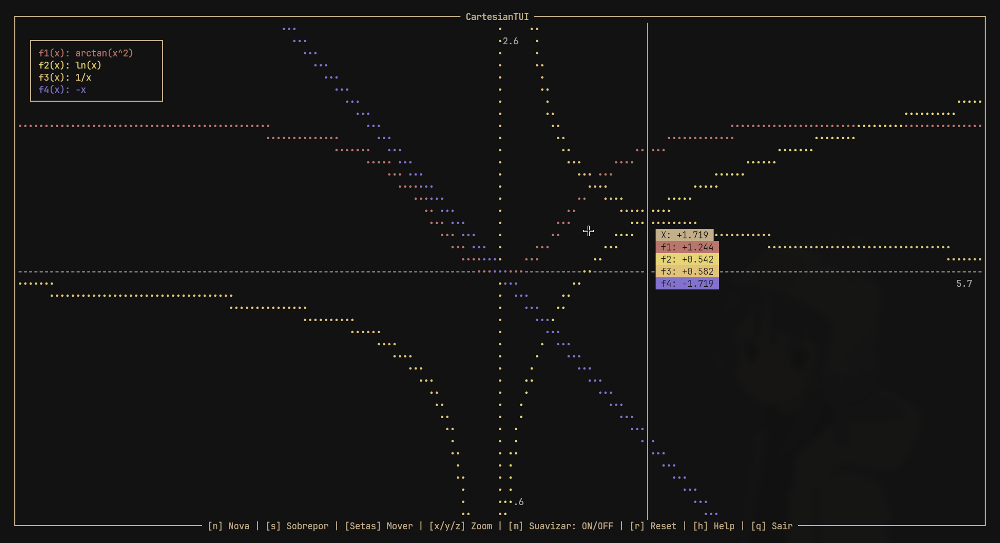
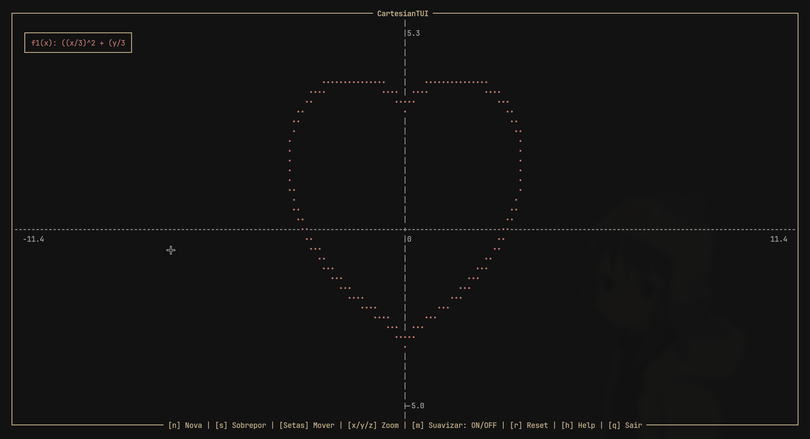
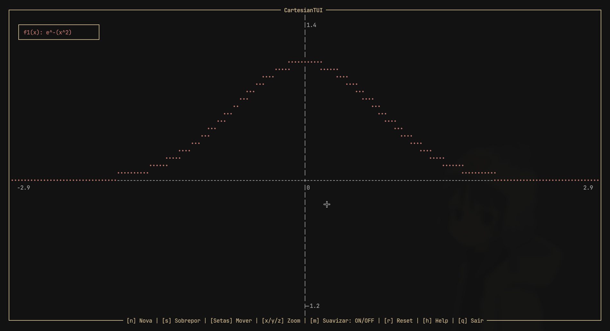
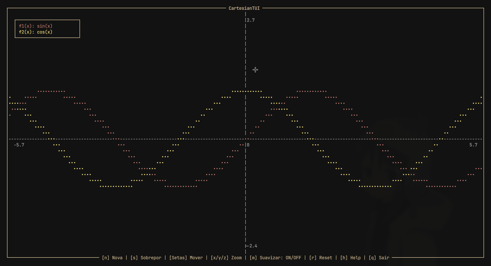
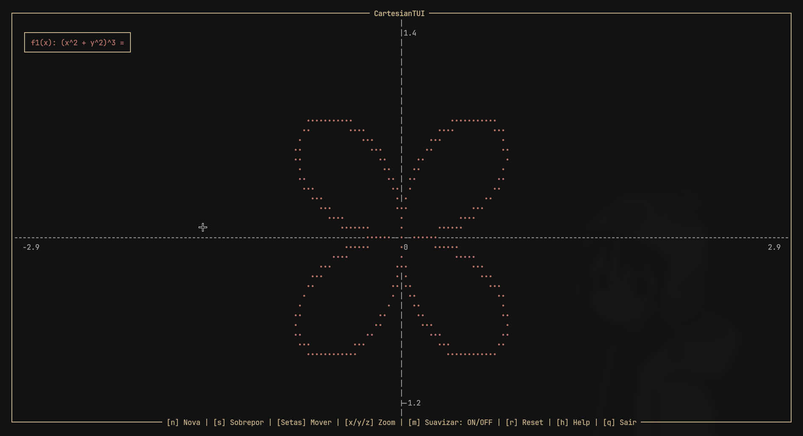

# CartesianTUI 📈

Um utilitário de plotagem de gráficos matemáticos desenhado inteiramente para o terminal. Desenvolvido em C, o **CartesianTUI** utiliza a biblioteca `ncurses` para renderizar uma interface de usuário rica, suportando múltiplas equações, movimentação suave de câmera e um motor matemático customizado.



## ✨ Principais Funcionalidades

- **Motor Matemático Robusto:** Avalia expressões complexas utilizando o Algoritmo Shunting-Yard e Notação Polonesa Inversa (RPN)[cite: 1].
- **Plotagem Avançada:** Suporta funções explícitas de X ($y = f(x)$), funções de Y ($x = f(y)$) e equações implícitas/multivariáveis (ex: $x^2 + y^2 = 25$)[cite: 4].
- **Renderização de Alta Precisão:** Utiliza subdivisão de células (sub-grid de 2x2) no terminal para calcular cruzamentos de zero e garantir o traçado preciso de curvas[cite: 4].
- **Entrada Inteligente:** Processa multiplicações implícitas automaticamente (ex: `2x` é convertido para `2 * x`, `piexsin(x)` para `pi * e * x * sin(x)`) e trata sinais negativos unários corretamente[cite: 1, 4].
- **Animação e Performance:** Conta com uma câmera de movimentação suave (via interpolação linear) e loop travado a ~60 FPS para não sobrecarregar a CPU do sistema[cite: 5].
- **Interação com Mouse:** Passar o mouse pelo gráfico exibe uma "mira" (crosshair) vertical e uma caixa de informações com o valor exato de Y para todas as funções ativas na coordenada X atual[cite: 4].

## 🖼️ Galeria

|         Gráfico de Coração (Equação Implícita)          |                    Curva de Sino                     |
| :-----------------------------------------------------: | :--------------------------------------------------: |
|  |  |

|         Intersecção de Ondas ($sin$ e $cos$)          |         Gráfico de Flor (Equação Implícita)          |
| :---------------------------------------------------: | :--------------------------------------------------: |
|  |  |

## 🧮 Funções Matemáticas Suportadas

O interpretador do CartesianTUI suporta um vasto dicionário de constantes, operadores e funções:

- **Operadores Básicos:** `+`, `-`, `*`, `/`, `^` (potência), `=` (para equações implícitas).
- **Constantes:** `pi`, `e`[cite: 1].
- **Trigonometria Básica:** `sin()`, `cos()`, `tan()`, `sec()`, `csc()`, `cot()`.
- **Trigonometria Inversa:** `arcsin()`, `arccos()`, `arctan()`, `arcsec()`, `arccsc()`, `arccot()`.
- **Trigonometria Hiperbólica:** `sinh()`, `cosh()`, `tanh()`, `sech()`, `csch()`, `coth()`.
- **Outras Funções:** `sqrt()` (Raiz quadrada), `log()` (Base 10), `ln()` (Logaritmo natural).

## 🎮 Controles e Navegação

A interface foi pensada para ser fluida e controlada quase que inteiramente pelo teclado:

- **`n`**: Inserir uma nova equação (limpa o histórico atual).
- **`s`**: Sobrepor equação (adiciona uma nova curva sem apagar as existentes).
- **`Setas`**: Movem a câmera / gráfico (Pan).
- **`x` / `X`**: Zoom In / Zoom Out apenas no eixo X.
- **`y` / `Y`**: Zoom In / Zoom Out apenas no eixo Y.
- **`z` / `Z`**: Zoom In / Zoom Out proporcional em ambos os eixos.
- **`m`**: Liga/Desliga a suavização de movimento da câmera.
- **`r`**: Reseta a visualização para as proporções e posição originais.
- **`h`**: Abre o painel flutuante de Ajuda.
- **`q`** ou **`ESC`**: Fecha os menus ou sai do programa.
- **`Mouse`**: Posicione o ponteiro na tela para ler coordenadas exatas. Clique com o botão direito para limpar a mira.

## 🛠️ Instalação e Compilação

Para compilar este projeto, você precisará de um ambiente Unix-like (Linux, macOS, WSL) com o compilador GCC e a biblioteca `ncurses` instalada.

* **Windows (via WSL):**
  Como o projeto utiliza a biblioteca `ncurses` (focada em sistemas Unix-like), a maneira mais fácil e performática de rodá-lo no Windows é utilizando o WSL (Windows Subsystem for Linux).

  **1.** Abra o seu **PowerShell** como Administrador e execute o comando abaixo para instalar o WSL e o Ubuntu padrão:
  ```powershell
  wsl --install
  ```
  **2.** Após a conclusão e uma possível reinicialização do sistema, abra o aplicativo **Ubuntu** no seu menu Iniciar.
  
  **3.** A partir daqui, o seu terminal funciona exatamente como um Linux real! Basta rodar os mesmos comandos da seção **Debian / Ubuntu / Mint** acima para instalar as dependências (`build-essential` e `libncurses-dev`), compilar e rodar a engine.

**1. Instale as dependências de acordo com a sua distribuição Linux:**

- **Debian / Ubuntu / Mint:**

  ```bash
  sudo apt update
  sudo apt install build-essential libncurses5-dev libncursesw5-dev
  ```

- **Fedora / RHEL / Rocky Linux:**

  ```bash
  sudo dnf install gcc make ncurses-devel
  ```

- **Arch Linux / Manjaro / EndeavourOS:**
  ```bash
  sudo pacman -S base-devel ncurses
  ```

**2. Clone e Compile:**
Navegue até a pasta do projeto e execute o compilador:

```bash
gcc -o cartesian main.c tui.c engine-core.c double-stack.c string-stack.c -lncurses -lm
```

_(A flag `-lncurses` vincula a biblioteca visual e a flag `-lm` vincula as bibliotecas matemáticas padrão do C)_.

**3. Execute:**

```bash
./cartesian
```
## 📄 Licença

Este projeto está sob a licença MIT. Veja o arquivo [LICENSE](LICENSE) para mais detalhes.
